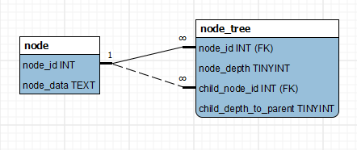

Expanded Depth Tree Table
=========================

There are several techniques to represent a tree in a database schema and it is 
quite an old problem. The usual solution being to have a `parentId` field and to
one of the more complicated ones I've come across, the [Nested Set Model](http://en.wikipedia.org/wiki/Nested_set_model).

The expanded depth tree is something I came up with a few years ago. It is not a
purely database driven solution and the idea may already be known in some variant
or another.

# General Concept



Consider the follwing table structures:

### Node

| node_id | node_data ... | 
|---------|---------------|
| primarykey | whatever data for that node |

### Node_Tree

| node_id | node_depth | child_node_id | child_depth_to_parent | 
|---------|------------|---------------|-----------------------|
| fk node_id in `node` table | depth from root of tree | fk node_id in `node` table | depth from parent node id |


Consider the following tree

 * node id:6 data: root
  * node id:4 data:branch
   * node is:2 data: leaf
   * node id:1 data: other leaf
  * node id:3 data: more leaf
  * node id:5 data: etc
   
This tree would be written to the above 2 tables thusly:

| node_id | node_data ... | 
|---------|---------------|
| 1 | other leaf |
| 2 | leaf |
| 3 | more leaf |
| 4 | branch |
| 5 | etc |
| 6 | root |

| node_id | node_depth | child_node_id | child_depth_to_parent | 
|---------|------------|---------------|-----------------------|
| 6 | 0 | NULL | 0 |
| 6 | 0 | 4 | 1 |
| 6 | 0 | 2 | 2 |
| 6 | 0 | 2 | 2 |
| 6 | 0 | 3 | 1 |
| 6 | 0 | 5 | 1 |
| 4 | 1 | NULL | 0 |
| 4 | 1 | 1 | 1 |
| 4 | 1 | 2 | 1 |
| 2 | 2 | NULL | NULL |
| 1 | 2 | NULL | NULL |
| 3 | 1 | NULL | NULL |
| 5 | 1 | NULL | NULL |

Each node is described as what depth the are located at in the tree absolute
to the root of the tree and the depth of each of their child nodes.

The `child_depth_to_parent` field is used to describe 3 states
	
	> 0	 - actual depth from parent
	NULL - is a leaf node.
	0	 - self reference entry for non-leaf nodes. Set to `0` to differentiate it from leaf nodes.

A tree with N nodes will result into N entries in the `node` table and a maximum of
N(N+1)/2 entries in the `node_tree` table.

Any add/remove operation on the tree would require a few queries to be executed
so it makes sense that the health of the tree be maintained via code.

# Example queries

All the following queries would be joined to the `node` table to get the relevant data

### get root node id

```sql
	SELECT 
		node_id 
	FROM node_tree 
	WHERE 
		node_depth = 0
		AND node_child_id IS NULL
		AND child_depth_to_parent = 0;
```


### get all leaf nodes

```sql
	SELECT
		node_id 
	FROM node_tree 
	WHERE 
		node_depth > 0
		AND node_child_id IS NULL
		AND child_depth_to_parent IS NULL;
```

### get parent(s) of node id:2

```sql
	SELECT 
		node_id 
	FROM node_tree 
	WHERE 
		node_child_id = 2
		AND child_depth_to_parent = 1;
```

### get immediate children of node id:6

```sql
	SELECT 
		child_node_id
	FROM node_tree 
	WHERE 
		node_id = 6
		AND child_depth_to_parent = 1;
```

### add node id:7 and make it parent of node id:6

Get current depth of node id:6

```sql
	SELECT 
		node_depth as old_node_depth
	FROM node_tree 
	WHERE 
		node_depth = 6
		AND node_child_id IS NULL
		LIMIT 1;
```

Increment the depth of all nodes under and including 6.

```sql
	UPDATE
		node_tree
	SET
		node_depth = (node_depth + 1)
	WHERE 
		node_id = 6
		OR node_id IN (get all nodes under 6 subquery);
```

Insert new node in tree

```sql
	INSERT INTO
		node_tree
		(node_id, node_depth, child_node_id, child_depth_to_parent )
	VALUES
		(7, old_node_depth, 6, 1);
```

Same principle should apply for any other node.

### Move node id:4 to be immediate child of node id:5

~~ wip ~~

Insert new row(s) node_id:5, depth:(depth of node 5 +1), child_node_id:4, child_depth_to_parent:1

Update depth of children of node id:4 to reflect new position.
	`update  (children_of_node_4 as c) aset c.node_depth to (c.node_depth + (new_depth_of_node_4 - old_depth_of_node_4))`


